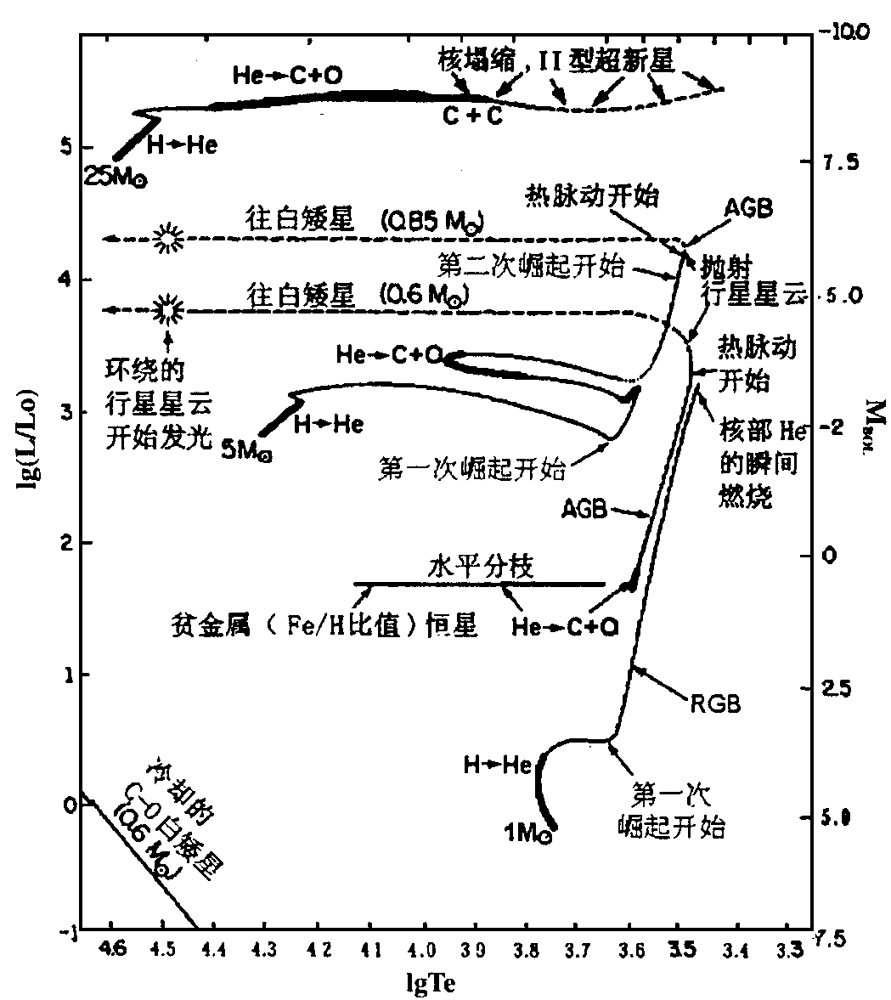
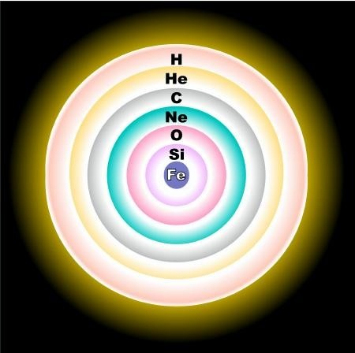

**我将在此分享一些我拍的图片和《天文学教程》一书的有意思知识点**

[陶哲轩的访谈](https://www.bilibili.com/video/BV1Je81zQEet/?spm_id_from=333.337.search-card.all.click&vd_source=cb820771210b463978fa2b2f70d01c5a)镇楼

其中有关火星轨道的确认部分太过美妙，不得不说开普勒还是传奇，给我那些第谷的数据我肯定死活想不出火星的轨道QaQ
## 图片

## 《天文学教程》知识点
### 第1章
### 第2章
### 第3章
### 第4章
### 第5章
### 第6章
### 第7章
### 第8章
### 第9章
看着漫天星河，我们首先想知道的一个问题就是恒星离我们多远，简单点入手，我们可以用三角视差、周年视差。

好的，我们还想知道恒星的究竟多亮（表面辐射功率），简单来看，和距离的平方成反比。

我们还想进一步，知道恒星的大小，这在知道距离后并不困难，只需测得角半径即可算出。

接下来是恒星的质量，很不幸，这确实很难测定(红巨星密度几乎与实验室的真空相差无几，而中子星可达10^{17}kg/m^{3})

不过我们可以知道恒星的运动速度和方向，长期观测得到。

我们想到观测不仅限于可见光波段，可否做光谱分析呢？恒星核聚变，所以辐射为连续光谱加吸收谱线，也有发射线，恒星光谱包含的信息可就多了，确实可以揭示化学组成、表面温度、光度、直径、磁场、视向运动、自转等很多性质

当然上述
### 第10章
**1.中子星里面还有质子吗，为什么是中子星而非质子星？**

中子星里没有质子，之所以形成中子星，是因为引力过于巨大，质子与电子间的电子简并压无法抵抗，巨大的压力将电子狠狠地压进原子核里，与质子结合，形成中子和中微子，即逆β衰变

*p（质子） + e⁻（电子） → n（中子） + νₑ（中微子）*
### 第11章
### 第12章
**1.太阳的演化**

太阳目前处于主序阶段中的主序演化阶段，中心区氢燃烧变成氦，内部基本准平衡，包括流体静力平衡（各层向外的压力被向内的引力所平衡）和热平衡（任意体元在每秒中获得的能量等于它释放的能量，每秒钟整个恒星表面辐射损失的能量与中央区热核反应产生的能量平衡），因此比较稳定。

随着氢不断聚变为氦，太阳中心区的核素总数目减少而总压力减少，重力作用下中心区收缩而温度升高，燃烧更快而释放更多能量使光度增强，驱使外层膨胀和冷却，反映在赫罗图上向右上演化。

当氦中心区因收缩而升温至1.2×10^{8}K，开始氦燃烧（氦聚变为碳、氧），太阳进入主序后的演化，此时的太阳称为红巨星，体积大（轨道接近地球公转轨道）、光度大（可达目前上千倍）。太阳这样的恒星（0.4-3M○）会出现失控的爆发性氦燃烧，称为**氦闪**：几分钟内产生巨大能量而使恒星光度增强，但很快调整到稳定的氦燃烧。于是，氢燃烧层内又有氦燃烧而膨胀的中心区，外层支持的辐射能量减少从而收缩与略变热，太阳在赫罗图上向左下移动。

氦燃烧耗尽后生成以碳氧灰烬组成的中心区，收缩变热，邻接层则发生氦燃烧，最外为氢燃烧层。红巨星的太阳变得不稳定，缓慢地（每隔几万年）交替收缩和膨胀，脉动振幅逐渐增大，最终抛出气壳成为行星状星云，留下星核坍缩成白矮星，后面转变为黑矮星。

{ style="display: block; margin: 0 auto;" }

  
行星演化赫罗图

### 第13章
**1.银河系很浩瀚，要是我们知道了边缘恒星到银河系中心的距离和相对中心的运动速度，我们如何估算银河系的质量呢？**

2009年用甚长基线阵测量得出银河系外缘恒星的速度达254km/s，基于圆轨道假设，向心力取决于半径R的轨道内所有物质的引力总和，（物质对称分布，轨道外物质引力相互抵消，模型类似大物球壳，当然不一样），结果为7×10^11M○，接近14年结果8.5×10^11M○

**2.银河系的星盘结构很神奇，是什么原因使得物质可以聚集在旋臂内，而不是形成土星环那样的均匀圆环呢？**

起初人们以为是大尺度磁场作用，但理论计算旋臂磁场太弱（2-6μGs），无法控制星际物质形成旋臂。

1942年，林德布拉德提出了一种密度波概念来解释星系旋涡结构，1964年来，美籍华裔天体学家林家翘及徐遐生等发展了密度波理论，得到一些符合观测结果，引起很大反响。

密度波概念可用公路上流动汽车比喻：若路上出现缓行货车，后面小汽车运行受阻，但不断有小汽车绕过货车高速行进，山上观测者于是可见货车后小汽车密集而货车前稀疏，形成密度波动。密度波理论认为，银盘有螺旋式引力波势波谷（相当于缓行货车），当在近于圆轨道上运动的气体和恒星（相当于奔驰小汽车）进入螺旋式的引力势波谷后，速度减慢，表现为物质聚集；当他们穿出波谷后，速度增加，表现为物质的松散。

密度波理论可以解决旋臂长久保持和旋臂缠卷问题，预示旋臂一般特征，因此取得很大成功，但它无法解释引力势波谷的起源、补偿密度波和激波耗能的供能机制和旋臂的分叉分支。
### 第14章
### 第15章
**1.核准平衡**

一颗质量足够大的恒星的一生中，可以发生一系列将轻元素熔合成较重元素的核合成过程（氢燃烧、碳燃烧、氧燃烧、硅燃烧）其中一种核燃料的灰在压缩加热后成为用于随后燃烧阶段的燃料，至核心坍缩前，大质量恒星内部的元素分布发展成为一种洋葱状结构。在恒星演化晚期，核燃烧从内部迅速向外层扩展，最终由于核心的重力坍塌形成的径向激波所引起的温度骤升，导致爆炸性燃烧。在这些快速反应的物理环境中，生成的每种元素丰度都达到平衡的固定值，称为核准平衡。

{ style="display: block; margin: 0 auto;" }

  
演化晚期大质量恒星内部的洋葱状结构

**2.宇宙中比铁更重的元素是如何产生的？**

### 第16章